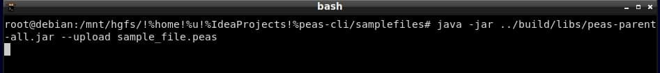
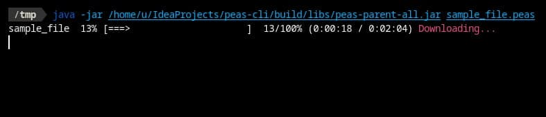
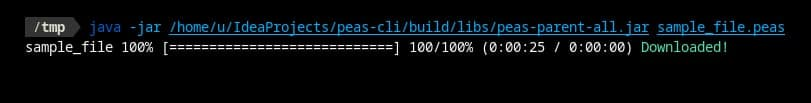
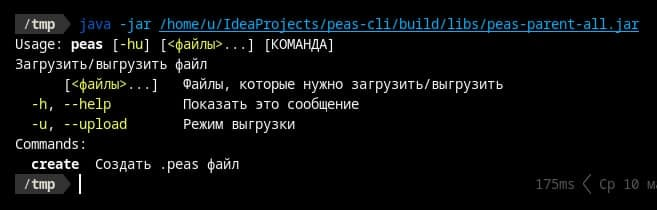
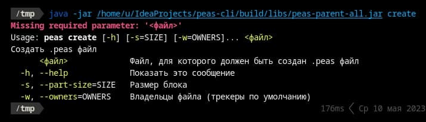

# peas-cli

## Системный анализ продукта

<a href="./misc/Системный анализ продукта.pdf">Посмотреть PDF файл</a>

## Области применения

1. Оптимизация механизма репликации баз данных (например в Cassandra, там есть только режимы single, ring)
2. Ускорение отправки snapshot версий на несколько backup серверов (например результаты аналитики big data)
3. Выпуск большого обновления клиентской части какой-либо игры (например вышло обновления на halloween)
4. Быстрая загрузка первичного ПО на только что купленные хосты с ansible (например для установки защитного обеспечения)

## Команды:

peas \[-hu\] \[<файлы>...\] 
&nbsp;&nbsp;&nbsp;&nbsp;Загрузить/выгрузить файл 
&nbsp;&nbsp;&nbsp;&nbsp;\[<файлы>...\]   Файлы, которые нужно загрузить/выгрузить 
&nbsp;&nbsp;&nbsp;&nbsp;-h, --help         Показать это сообщение 
&nbsp;&nbsp;&nbsp;&nbsp;-u, --upload       Режим выгрузки 

peas create \[-h\] \[-s=SIZE\] \[-w=OWNERS\]... \<файл\> 
&nbsp;&nbsp;&nbsp;&nbsp;Создать .peas файл 
&nbsp;&nbsp;&nbsp;&nbsp;\<файл\>             Файл, для которого должен быть создан .peas файл 
&nbsp;&nbsp;&nbsp;&nbsp;-h, --help             Показать это сообщение 
&nbsp;&nbsp;&nbsp;&nbsp;-s, --part-size=SIZE   Размер блока 
&nbsp;&nbsp;&nbsp;&nbsp;-w, --owners=OWNERS    Владельцы файла (трекеры по умолчанию) 

